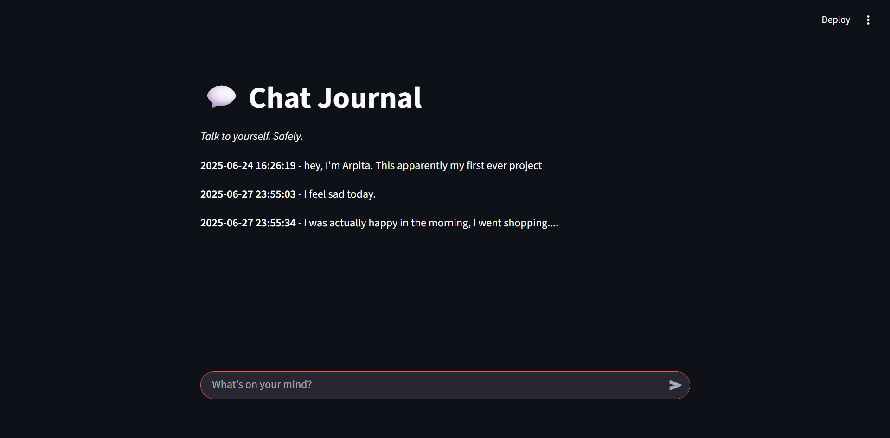

# 💬 ChatJournal App

**ChatJournal** is a minimal, private journaling web app built using **Python** and **Streamlit**.  
It lets you write, store, and reflect on your thoughts like a personal chat with yourself.

---

## 🚀 Features

- 📝 Write journal entries in a chat-style interface
- 💾 Entries are stored and displayed chronologically
- 🎯 Minimal, distraction-free UI
- 🔒 Local-first and secure (no third-party storage yet)

---

## 🛠️ Built With

- [Streamlit](https://streamlit.io) – For the front-end interface
- Python – For app logic and data handling
- JSON – To store journal entries locally (simple and readable)

---

## 📸 Screenshot



---

## 🧠 Inspiration

I wanted to build something simple but meaningful — a space to **talk to yourself**, reflect on your day, and track thoughts without distractions or unnecessary features.  
ChatJournal is my take on that: **journaling, simplified like a conversation.**

---

## 🧰 How to Run

```bash
# 1. Clone this repo
git clone https://github.com/yourusername/chatjournal.git
cd chatjournal

# 2. Create virtual environment (optional but recommended)
python -m venv venv
source venv/bin/activate  # On Windows: venv\Scripts\activate

# 3. Install dependencies
pip install -r requirements.txt

# 4. Run the app
streamlit run app.py
